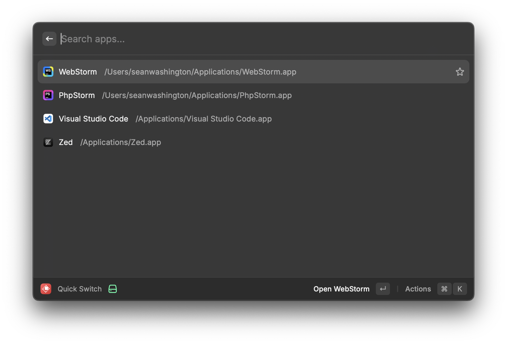

# Quick Switch

Quick switch is a simple Raycast extension that allows you to switch between a configurable set of apps quickly.

I often use keybinds like `hyper + c` to jump to specific applications, but I also like to rotate between different editors. This meant that I would have to update Raycast's settings, or my Karabiner Elements config to change the keybinds. This extension allows me to quickly switch between editors without having to change keybinds every time my preferred editor changes.

## Installation & setup

* [Install the extension](https://developers.raycast.com/basics/contribute-to-an-extension)
* Configure the apps you want to switch between in the extension settings via the extension preferences
* Configure the extension's keybind

## Usage

Using the extension will show you the list of apps that you've configured. You can select one of them to switch to it. The next time you use the keybind, the previously selected app will be at the top of the list. That's it!

## Resources

* https://developers.raycast.com
* https://developers.raycast.com/basics/create-your-first-extension